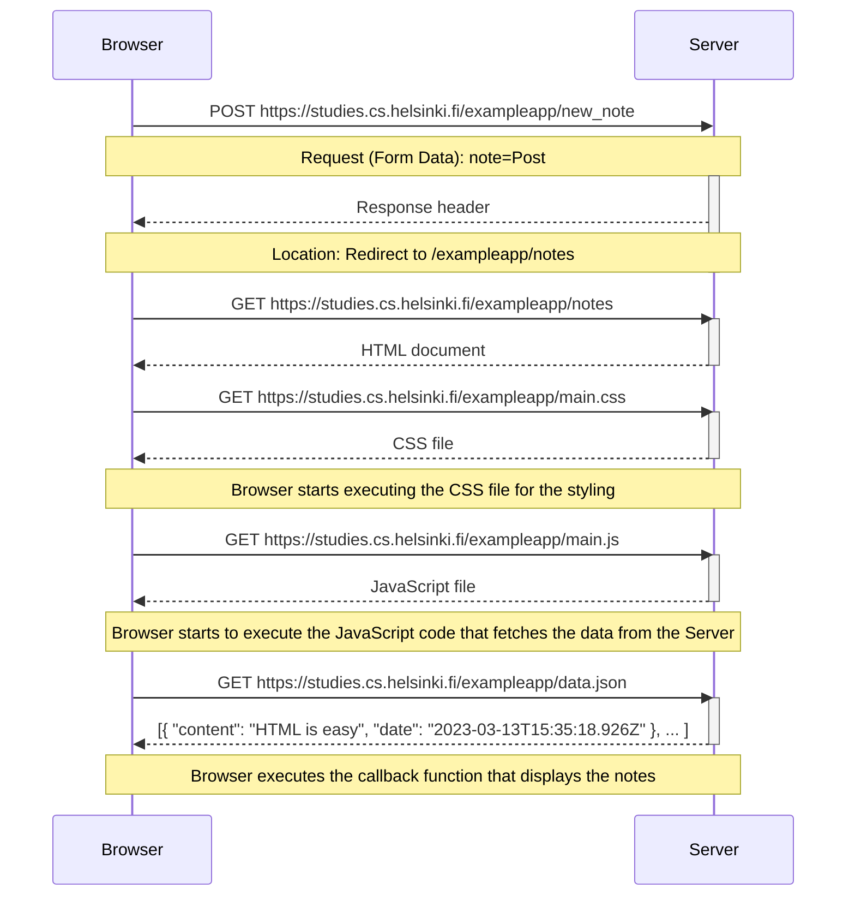

```mermaid
sequenceDiagram
 
    Browser->>Server: POST https://studies.cs.helsinki.fi/exampleapp/new_note
    Note over Browser, Server: Request (Form Data): note=Post
    activate Server
    Server-->>Browser: Response header
    Note over Browser, Server: Location: Redirect to /exampleapp/notes
    deactivate Server
    Browser->>Server: GET https://studies.cs.helsinki.fi/exampleapp/notes
    activate Server
    Server-->>Browser: HTML document
    deactivate Server


    Browser->>Server: GET https://studies.cs.helsinki.fi/exampleapp/main.css
    activate Server
    Server-->>Browser: CSS file
    deactivate Server
    Note over Browser, Server: Browser starts executing the CSS file for the styling


    Browser->>Server: GET https://studies.cs.helsinki.fi/exampleapp/main.js
    activate Server
    Server-->>Browser: JavaScript file
    deactivate Server
    Note over Browser, Server: Browser starts to execute the JavaScript code that fetches the data from the Server


    Browser->>Server: GET https://studies.cs.helsinki.fi/exampleapp/data.json
    activate Server
    Server-->>Browser: [{ "content": "HTML is easy", "date": "2023-03-13T15:35:18.926Z" }, ... ]
    deactivate Server
    Note over Browser, Server: Browser executes the callback function that displays the notes
```
